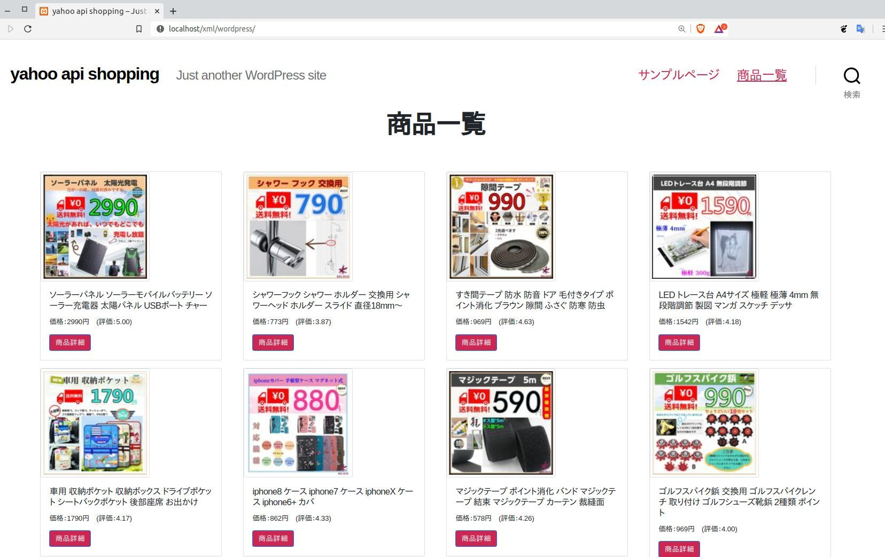

## Yahoo API Shopping を使って自社ECサイトをラクラク管理

### ソリューション

現在 Yahoo! ショッピングサイト、PayPay に合わせて盛り上がっているが、自社の EC サイトとダブル管理になっているお店も少なくないヨウス。

"ダブル管理" 手間と時間、ストレスによってモチベーション低下、売上低下、国力の低下.... チョット大げさですが。

こういうパターンのストレスを本 WordPress テーマが手伝ってくれると思います。

## 流れ

WordPress の固定ページレイアウトで Yahoo ショッピングのアイテム情報を自動取得し、商品一覧を自動表示。

これで自社サイトで商品管理をしなくていいですね。

商品管理は、 Yahooショッピング側で行い、 Yahooショップで登録した情報が自社サイトに転送される、そんなイメージですね。

## 設定

```wordpress/wp-content/themes/twentytwenty/``` 内の 2つのファイルで商品一覧を制御。

+ wp_singular.php
+ header-1.php

wp_singular.php で Yahoo API データを取得、 API ID や store_id を変更して下さい。

[Yahoo API 公式doc](https://developer.yahoo.co.jp/)

## もっと...

レイアウトが乏しいです。それから商品を WordPress のデータベースに登録していませんので、 Yahoo API でデータをデータベースに入れるか、ブログ形式で商品記事を作成し、 データベースに登録しないと、自社サイトの "検索時" に商品がヒットしません。

## 期待

自社ECサイトの管理手間削減に期待でき、ブログなどで商品の How To や "こんな使い方も..." 的な前向きな仕事に時間を作れそうです。そして売上アップ.... 中長期的に期待できますね。